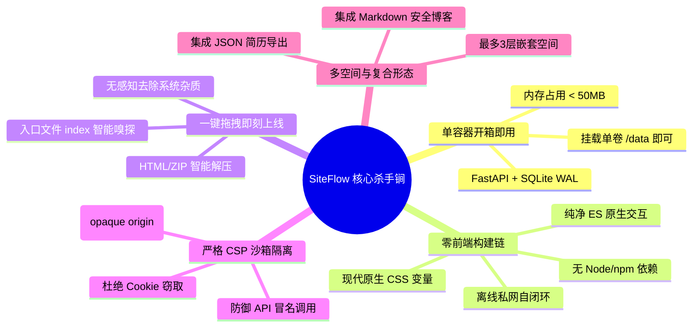
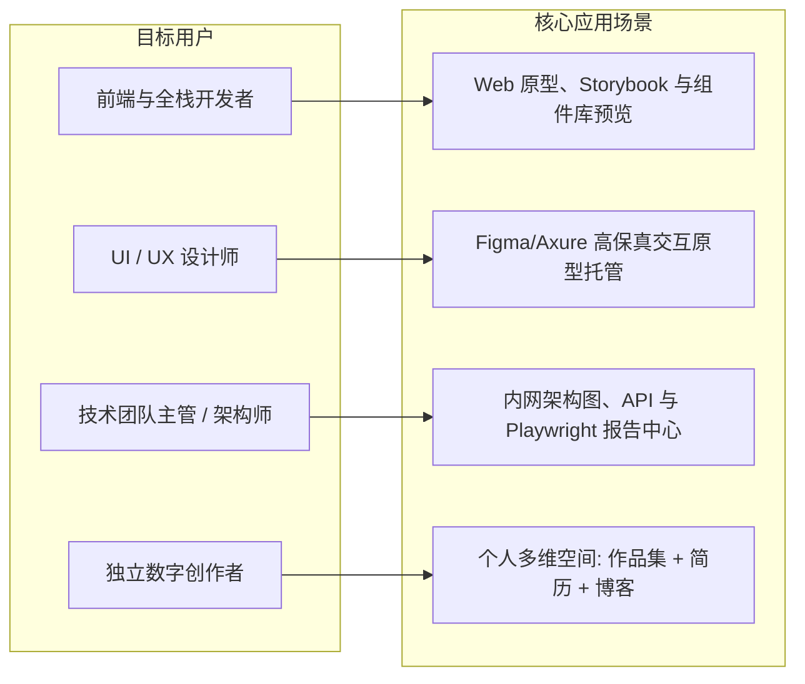
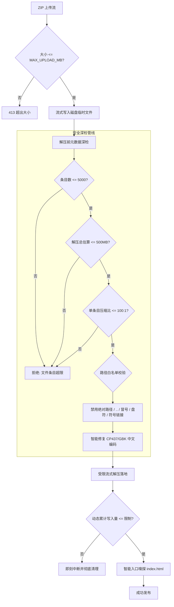
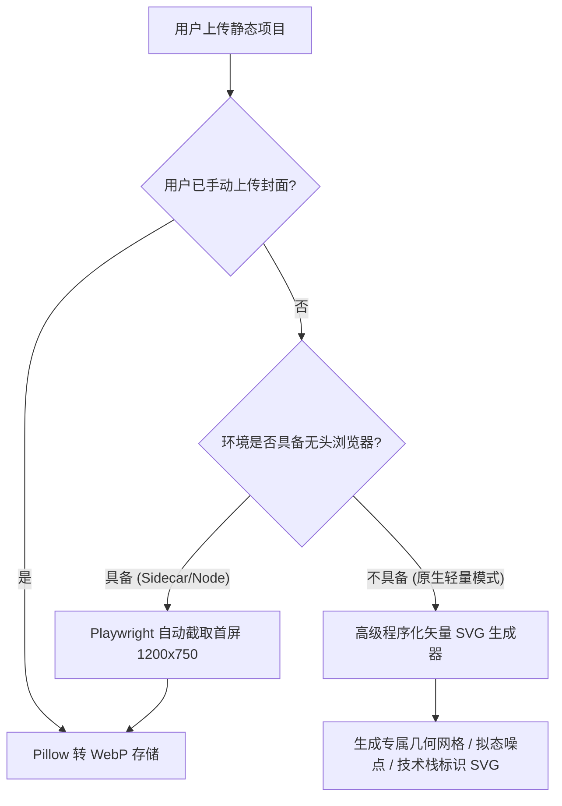
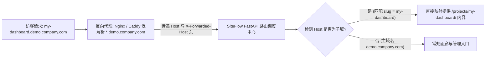
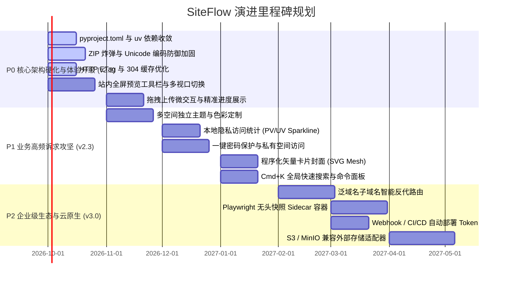

# SiteFlow 产品深度调研与全景演进白皮书

> **文档性质**：产品规划与技术演进指导白皮书  
> **适用版本**：SiteFlow v2.1 审查与 v2.2 ~ v3.0 演进蓝图  
> **编写团队**：SiteFlow 核心产品架构师与 Web 前端/内容托管专家组  
> **日期**：2026-09-20  

---

## 目录

- [1. 背景调查与行业趋势](#1-背景调查与行业趋势)
  - [1.1 静态作品与前端制品分发的新范式](#11-静态作品与前端制品分发的新范式)
  - [1.2 内网与自托管环境下的痛点断层](#12-内网与自托管环境下的痛点断层)
  - [1.3 传统自托管方案的繁琐度与安全隔离死穴](#13-传统自托管方案的繁琐度与安全隔离死穴)
- [2. 开源与商业同类产品深度对比](#2-开源与商业同类产品深度对比)
  - [2.1 主流竞品全景对照矩阵](#21-主流竞品全景对照矩阵)
  - [2.2 核心维度技术纵深剖析](#22-核心维度技术纵深剖析)
  - [2.3 现有市场空白与 SiteFlow 的切入契机](#23-现有市场空白与-siteflow-的切入契机)
- [3. 本产品定位与核心杀手级特点](#3-本产品定位与核心杀手级特点)
  - [3.1 核心定位与价值观](#31-核心定位与价值观)
  - [3.2 五大杀手级核心特性](#32-五大杀手级核心特性)
- [4. 目标用户画像与核心应用场景](#4-目标用户画像与核心应用场景)
  - [4.1 典型用户角色画像](#41-典型用户角色画像)
  - [4.2 核心业务与使用场景矩阵](#42-核心业务与使用场景矩阵)
- [5. 当前代码与已实现功能深度盘点](#5-当前代码与已实现功能深度盘点)
  - [5.1 全局架构拓扑与代码审查](#51-全局架构拓扑与代码审查)
  - [5.2 各核心模块审计现状](#52-各核心模块审计现状)
  - [5.3 发现的代码缺陷与设计妥协](#53-发现的代码缺陷与设计妥协)
- [6. 现有功能强化与底层架构加固](#6-现有功能强化与底层架构加固)
  - [6.1 项目构建与依赖管理现代化（pyproject.toml + uv）](#61-项目构建与依赖管理现代化pyprojecttoml--uv)
  - [6.2 大文件与 ZIP 解压安全防御纵深（ZipBomb / Path Traversal / Unicode）](#62-大文件与-zip-解压安全防御纵深zipbomb--path-traversal--unicode)
  - [6.3 静态资源 HTTP 缓存头与 ETag 条件请求优化](#63-静态资源-http-缓存头与-etag-条件请求优化)
- [7. UI 与交互逻辑重塑（第一印象质感跃迁）](#7-ui-与交互逻辑重塑第一印象质感跃迁)
  - [7.1 现状交互痛点与设计审计](#71-现状交互痛点与设计审计)
  - [7.2 站点卡片封面生成方案（程序化矢量 + 无头快照）](#72-站点卡片封面生成方案程序化矢量--无头快照)
  - [7.3 拖拽上传与任务进度微交互动效](#73-拖拽上传与任务进度微交互动效)
  - [7.4 多空间切换树状侧栏与全局命令面板（Cmd+K）](#74-多空间切换树状侧栏与全局命令面板cmdk)
  - [7.5 沉浸式站内全屏预览工具栏与多设备视口切换](#75-沉浸式站内全屏预览工具栏与多设备视口切换)
- [8. 缺失关键功能攻坚与用户痛点落地方案](#8-缺失关键功能攻坚与用户痛点落地方案)
  - [8.1 多空间独立主题与色彩系统定制](#81-多空间独立主题与色彩系统定制)
  - [8.2 隐私合规的轻量化访问统计（PV/UV Sparkline）](#82-隐私合规的轻量化访问统计pvuv-sparkline)
  - [8.3 自定义子域名与反向代理泛解析智能路由映射](#83-自定义子域名与反向代理泛解析智能路由映射)
  - [8.4 一键密码保护与私有空间访问隔离机制](#84-一键密码保护与私有空间访问隔离机制)
- [9. 未来分期演进计划与落地路线图（P0 / P1 / P2）](#9-未来分期演进计划与落地路线图p0--p1--p2)
  - [9.1 阶段规划与交付里程碑](#91-阶段规划与交付里程碑)
  - [9.2 关键演进对比表](#92-关键演进对比表)
- [10. 结论与总结](#10-结论与总结)

---

## 1. 背景调查与行业趋势

### 1.1 静态作品与前端制品分发的新范式

随着现代 Web 前端工程的演进，构建产物的形态正在发生深刻变革。Vite、Next.js (Static Export)、Astro、Nuxt、SvelteKit 等现代工具链让静态站点的表现力大幅超越了传统页面：
- **复杂交互制品频现**：WebGL 渲染视效、Canvas 创意互动、WASM 客户端算法、WebGPU 数据可视化、Figma/Axure 导出的保真交互原型；
- **自动化测试与工程报告**：Playwright / Cypress 自动化测试生成的富交互 HTML 报告、Lighthouse 审计性能报告、Swagger / Redoc 离线 API 文档、TypeDoc / JSDoc 静态代码文档；
- **个人品牌与知识载体**：技术博客、独立简历、摄影设计作品集、微型独立产品落地页（Landing Page）。

这些制品本质上都是由 HTML、CSS、JS 及富媒体组成的静态目录包。然而，从本地 `npm run build` 或设计软件导出得到一个 `.zip` 文件，到把这个页面优雅、安全、便捷地呈现在访客或团队面前，中间存在着巨大的工程与体验鸿沟。

### 1.2 内网与自托管环境下的痛点断层

在公开互联网上，开发者享受着 Vercel、Netlify、Cloudflare Pages 等 Jamstack 托管平台带来的便利（拖拽即上线、全球 CDN、自动化证书）。然而，当场景转移到**企业内部网络、数据保密项目、科研机构、政府单位以及个人私有 NAS/服务器**时，公网 SaaS 服务全部失效：
1. **合规与数据红线**：商业机密、未公开的产品原型、内部技术白皮书、客户专属 Demo 严禁上传至第三方公网云平台；
2. **离网与内网隔离**：许多研发环境部署在物理隔离内网或需通过专属 VPN 访问，公网 SaaS 无法触达；
3. **供应商锁定与成本**：公网托管平台免费额度受限，企业版坐席与带宽收费高昂，且难以定制数据归属。

### 1.3 传统自托管方案的繁琐度与安全隔离死穴

面对内网与自托管诉求，过去行业主流方案存在严重的体验断层与致命的安全缺陷：

```mermaid
flowchart TD
    subgraph 传统自托管痛点
        A[开发者导出 ZIP] --> B[SCP/SFTP 上传服务器]
        B --> C[SSH 登录解压到 /var/www]
        C --> D[编写/修改 Nginx vhost 配置]
        D --> E[nginx -s reload 重载]
        E --> F[无统一画廊索引 难以检索]
        F --> G[致命: 同域未隔离 XSS 与会话劫持]
    end
    subgraph SiteFlow 理想解
        H[开发者拖拽 ZIP/HTML] --> I[Web UI 极速上传]
        I --> J[服务端安全解压 + 入口嗅探]
        J --> K[自动加入美观画廊卡片]
        K --> L[CSP: sandbox 严格不透明源隔离]
    end
```



#### 传统方案的主要弊端：
1. **配置极其繁琐（Ops Friction）**：
   - 使用 Nginx / Caddy 自建静态托管时，每新增一个项目就需要 SSH 登录服务器、SCP 传文件、解压、创建目录、修改 `nginx.conf` 的 `location` 或虚拟主机、重载服务。
   - 非技术人员（如 UI 设计师、产品经理）完全无法独立操作，频繁打扰运维人员。
2. **MinIO / S3 静态托管体验水土不服**：
   - MinIO 作为对象存储虽然支持静态网站模式，但缺乏友好的多站点画廊首页，无法自动嗅探解压 ZIP，需要配置复杂的 Bucket Policy、SPA 路由重写规则，且 MinIO 本身内存与磁盘占用相对静态托管偏重。
3. **致命的“同源 XSS 攻击面”（Shared-Origin Catastrophe）**：
   - 这是大多数自建内网托管平台的**阿喀琉斯之踵**。当通过 `https://demo.internal.company.com/project-a/` 和 `https://demo.internal.company.com/project-b/` 托管多个不可信或第三方的静态包时，**所有站点共享相同的协议、主机名和端口（Origin）**。
   - 如果某个静态 Demo 包含恶意或带有漏洞的 JS 脚本：
     - 它可以通过 `document.cookie` 窃取同源的管理会话凭据；
     - 它可以向主站的管理 API 发起合法的同源请求（如静默删除项目、添加恶意管理员）；
     - 它可以跨路径读取或篡改 `localStorage`、`IndexedDB` 中的敏感数据；
     - 它可以跨路径发起钓鱼攻击。
   - **常规 Nginx 静态配置几乎没有对静态文件注入沙箱响应头**，导致整个内网服务沦为提权靶场。

---

## 2. 开源与商业同类产品深度对比

为了准确定位 SiteFlow，本白皮书对当前主流的静态托管工具与平台进行了全方位、多维度的技术比对。

### 2.1 主流竞品全景对照矩阵

| 对比维度 | SiteFlow | Surge.sh | Netlify Drop | Cloudflare Pages | Caddy file-server | MinIO 静态托管 |
| :--- | :--- | :--- | :--- | :--- | :--- | :--- |
| **部署形态** | **单 Docker 容器 (本地/私有)** | 公网云平台 (SaaS) | 公网云平台 (SaaS) | 公网边缘云 (SaaS) | 单二进制文件 (自托管) | 集群/单机对象存储 (自托管) |
| **网络要求** | **完全离线 / 内网专网** | 必须连接公网 | 必须连接公网 | 必须连接公网 | 完全离线 / 内网可用 | 完全离线 / 内网可用 |
| **上传交互** | **Web 端拖拽 ZIP/HTML/链接** | CLI 命令行 (`surge ./`) | Web 拖拽文件夹/ZIP | Git 联动 / Wrangler CLI | SCP / SFTP / 共享卷 | S3 CLI / S3 API / Console |
| **画廊聚合展示** | **内置美观响应式卡片画廊** | 无 (单域名单项目) | 无 (仅散落站点列表) | 无 (仅 DevOps 控制台) | 仅粗糙目录索引列表 | 仅文件桶文件树 |
| **多层级/空间** | **支持 (3层空间/文件夹)** | 不支持 | 不支持 | 不支持 (按项目独立) | 仅操作系统目录树 | 仅 Bucket/前缀划分 |
| **安全沙箱隔离** | **强隔离 (`CSP: sandbox`)** | 依靠独立二级子域隔离 | 依靠独立二级子域隔离 | 依靠独立二级子域隔离 | **无隔离 (同源共存风险)** | **无隔离 (同源共存风险)** |
| **内置应用能力** | **空间 + JSON简历 + Markdown博客**| 无 | 无 | 无 (需开发者自行部署) | 无 | 无 |
| **系统运行时依赖** | **Python + SQLite (零编译/无Node)**| Node.js CLI 客户端 | 浏览器 (闭源云端) | Git / Cloudflare 账号 | Go 独立运行时 | Go 独立运行时 (偏重) |
| **内存与磁盘占用** | **内存 < 50MB，体积极小** | 客户端工具 | 无本地占用 | 无本地占用 | 内存 30-50MB | 内存通常 > 200MB+ |

### 2.2 核心维度技术纵深剖析

#### 1. 上传与分发门槛（Web Drag-and-Drop vs CLI / Git）
- **Surge / Cloudflare Pages** 严重依赖开发者工具链（Terminal、Node.js、Git、CLI Token）。对于需要快速向客户演示设计搞的 UI/UX 设计师、或是仅有浏览器环境的产品经理而言，门槛过高。
- **Netlify Drop** 提供了绝佳的网页拖拽体验，但其底层完全托管于 Netlify 商业云，无法用于保密内网。
- **SiteFlow** 将 Netlify Drop 的极致拖拽易用性与自托管单容器相结合：浏览器端将 `.html` 或 `.zip` 拖入虚线框，后端自动完成临时流式缓冲、安全沙箱检测、解压、编码修正与入口嗅探，数秒内直接在画廊生成卡片，实现了“即拖即用”。

#### 2. 多空间与画廊聚合（Curated Gallery vs Raw Directory）
- 传统的 **Caddy `file_server browse`** 或 **Nginx `autoindex`** 仅仅呈现裸露的操作系统文件夹与文件大小列表，没有任何封面、描述、标题、标签或移动端自适应，缺乏视觉吸引力与展示仪式感。
- **SiteFlow** 定位不仅是一个文件服务器，更是一个“作品策展平台（Curated Portfolio & Canvas）”：
  - 自动呈现响应式卡片网格；
  - 具备置顶（Pin）、手动精确排序、显隐切换能力；
  - 支持多层级嵌套“空间（Space）”，让不同团队、不同项目类别（如 `UI组件库` / `客户Demo` / `季度大促落地页`）各得其所；
  - 集成内置专用应用（简历导出、博客等），形成高集约度的个人/团队知识门户。

#### 3. 安全沙箱模型：同源危机下的破局点
- 在传统单机或单域名部署多个 HTML 站点时，各大工具由于缺乏深度安全考量，往往直接输出文件流，导致同域脚本可自由窃取管理员 Cookie。
- **Netlify / Cloudflare** 的做法是为每个站点分配一个独立的二级子域（如 `site-abc.netlify.app`），通过浏览器原生同源策略（Same-Origin Policy）实现物理隔离。但这在私有单机部署中需要泛域名证书、内部 DNS 泛解析以及复杂的反代动态配置，运维门槛极高。
- **SiteFlow 的破局创新**：在**单一域名、单端口、同一 URL 路径结构**的前提下，创新性地运用了 W3C 的 `Content-Security-Policy: sandbox allow-scripts allow-forms allow-modals allow-popups allow-downloads`。
  - **不声明 `allow-same-origin`**，强制让被展示的静态作品处于**不透明源（opaque origin / unique origin）**。
  - 浏览器将该页面的 Origin 视为 `null`。该页面中的任何脚本均无法读取宿主域名的 Cookie、LocalStorage、IndexedDB，且发往宿主 API 的请求会被浏览器作为跨域跨源无凭证请求拦截。
  - 这在**无需额外域名配置**的条件下，构筑了铜墙铁壁般的安全防线。

### 2.3 现有市场空白与 SiteFlow 的切入契机

通过对比可以清晰地看到市场的巨大空白地带：
> **市场亟需一款“既有 Netlify Drop 的丝滑 Web 体验，又有 Nginx 的轻量自托管属性，同时具备企业级 CSP 强沙箱隔离与优雅画廊聚合能力”的轻量化工具。**

SiteFlow 恰恰稳准狠地切入了这片蓝海，成为内网原型展示、设计团队成果陈列、个人多形态作品集托管的终极解决方案。

---

## 3. 本产品定位与核心杀手级特点

```
┌──────────────────────────────────────────────────────────────────────────┐
│                               SiteFlow 定位                               │
│  自托管 Docker 化轻量级静态制品画廊与安全沙箱展示平台 (All-in-One Canvas) │
└──────────────────────────────────────────────────────────────────────────┘
```

### 3.1 核心定位与价值观

SiteFlow 专为**追求极致敏捷、视觉审美与数据自主权**的开发者、设计师与小微技术团队设计。  
它的核心价值观是：**“极简部署、零心智负担、极致视觉、严苛安全”**。

### 3.2 五大杀手级核心特性



#### 特性一：单容器极简开箱即用（Single-Container Autonomy）
- 没有任何外部数据库（无需 MySQL/PostgreSQL/Redis），单一容器镜像内置高并发 SQLite (开启 WAL 模式与 5000ms busy timeout)。
- 数据的全部状态（数据库、密码密钥、静态工程文件、媒体封面）统一收敛在 `/data` 挂载卷中，备份、迁移、容灾只需 `tar -czf data.tar.gz data/` 即可完成。

#### 特性二：零前端构建工具链与现代化纯生体验（Zero-Build Purity）
- 摒弃了现代前端臃肿的构建流程（无 Node.js、Webpack、Vite、npm 构建依赖）。
- 采用现代标准 CSS 自定义属性（CSS Custom Properties）、响应式 CSS Grid、原生 SVG 内联图标系统。
- 原生支持系统级深浅色主题自适应（`prefers-color-scheme`），整个前端静态资源小于 50KB，毫秒级冷启动，天然免疫 Node 生态的供应链投毒风险。

#### 特性三：HTML 单文件 / ZIP 压缩包一键上传解压即看（Frictionless Ingestion）
- 无论用户上传的是单文件 HTML，还是多层打包、包含顶层嵌套目录、或是由 macOS 打包生成的夹带 `__MACOSX/` 和 `.DS_Store` 的 ZIP 压缩包，SiteFlow 服务端流式管线均能自动过滤操作系统垃圾，智能递归定位最浅层的 `index.html` 作为入口，实现“拖入即发布”。

#### 特性四：同域强安全沙箱隔离（Strict Opaque-Origin Sandbox）
- 通过向所有 `/projects/{slug}/` 路径下的静态响应全局注入：
  ```http
  Content-Security-Policy: sandbox allow-scripts allow-forms allow-modals allow-popups allow-downloads
  X-Content-Type-Options: nosniff
  ```
  作品页面的 JavaScript 可以在沙箱内自由运行（支持三维动画、视效、逻辑表单），但被浏览器剥夺了对父域的任何特权访问权限，从底层阻断了 XSS 跨站提权。

#### 特性五：多空间多层级画廊与插件生态（Hierarchical Spaces & App Ecosystem）
- 突破了一般托管工具“扁平列表”的限制，支持高达 3 层的空间嵌套（根画廊 -> 主题空间 -> 子空间/项目）。
- 具备开放的应用协议插件系统，已无缝内置 JSON Resume（支持 `@media print` 高保真 PDF 打印导出）和 Markdown 博客（采用严格禁用原始 HTML 的 CommonMark 安全解析器）。

---

## 4. 目标用户画像与核心应用场景



### 4.1 典型用户角色画像

| 角色画像 | 核心诉求 | 现有痛点 | SiteFlow 解决方案 |
| :--- | :--- | :--- | :--- |
| **全栈/前端开发者 (Alex)** | 频繁需要向客户、后端或测试分享单页原型、Three.js 动效 Demo、静态构建产物。 | 配置 Nginx 太慢；发给客户代码包对方不会运行；公网 Vercel 会被内网网络策略拦截。 | 本地直接把 `dist.zip` 拖入 SiteFlow，立刻获得一个带沙箱、可直接分享的链接。 |
| **UI/UX 设计师 (Sarah)** | 展示从 Axure、Figma、Protopie 导出的 HTML 交互原型，呈现个人高保真作品集。 | 不懂 Linux/SSH，无法自行配置服务器；公网产品集平台不够纯粹且有版权泄漏风险。 | 登录美观的管理后台，拖拽上传，系统自动渲染漂亮卡片，支持设置独立空间并分类归档。 |
| **技术团队架构师 (David)** | 统一沉淀团队内的静态工程资产：Swagger API 文档、Lighthouse 报告、单元测试覆盖率报告。 | 缺乏统一门户聚合，报告散落在各个 CI 构建目录或文件服务器中，查找极为低效。 | 将 SiteFlow 部署在内网研发测试网，CI 脚本通过标准 API 自动上传打包报告，多空间自动分层展示。 |
| **独立咨询师/创作者 (Elena)** | 搭建个人数字门户，同时展示静态作品案例、外部知名项目链接、中英文简历以及技术随笔。 | 维护 WordPress/Notion 太重；单一静态站点生成器缺乏灵活的多形态聚合与拖拽扩展能力。 | 单一容器运行 SiteFlow，利用内置空间、Resume 与 Blog 插件，一站式打造极具个人审美的数字名片。 |

### 4.2 核心业务与使用场景矩阵

1. **场景一：敏捷产品评审与客户即时演示**  
   研发与设计在完成冲刺阶段成果后，打包导出原型，通过 SiteFlow 的“空间”快速创建“2026-Q3 产品大版本评审”专题。评审人员打开画廊即可一览所有待审模块，在沙箱保护下无须担心原型内包含的外链脚本威胁内网系统。
2. **场景二：自动化 CI/CD 静态制品归档分发**  
   在 GitLab CI / Jenkins 构建流水线中，通过 `curl -X POST -F "file=@dist.zip" http://siteflow/api/admin/...`，自动将每晚构建的 Storybook、Playwright 测试报告推送到对应项目的子空间中，团队成员打开画廊即可直接追溯历史制品。
3. **场景三：求职与商务合作的高保真私有主页**  
   求职者将作品源代码的静态导出包放入 SiteFlow，主页卡片直观呈现项目封面与描述，并直接联动内置的 JSON 简历插件，支持一键在浏览器中唤起打印生成排版严谨的 PDF 简历，展现极高的专业工程素养。

---

## 5. 当前代码与已实现功能深度盘点

经过对 `/home/mcocdaa/AI_CODE/SiteFlow` 全量源码的细致审查，本节对当前代码实现进行系统性盘点与审计。

### 5.1 全局架构拓扑与代码审查

```
SiteFlow 架构分层
├── [接入与安全层] (app/main.py, app/auth.py)
│   ├── 安全响应头中间件 (CSP, X-Frame-Options, X-Content-Type-Options)
│   └── 认证鉴权体系 (Argon2, itsdangerous 签名 Cookie, CSRF 防御, 登录频控)
├── [路由与控制层] (app/routes.py, app/views.py, app/admin.py)
│   ├── 访客端路由 (/projects/*, /media/*, /login, /healthz)
│   └── 管理端 API (/api/admin/projects/*, 文件/链接/内容 CRUD)
├── [数据与存储层] (app/store.py, app/models.py, app/config.py)
│   ├── SQLAlchemy 模型 (Project 树状自引用 parent_id)
│   └── SQLite WAL 引擎与无缝列迁移机制 (_migrate)
├── [文件处理管线] (app/uploads.py, app/og.py)
│   ├── ZIP 安全解压与入口嗅探 (extract_site)
│   ├── 封面图 Pillow 格式校验/缩略/EXIF 剥离 (make_cover)
│   └── 外部链接 Open Graph 抓取 (fetch_og)
├── [插件化应用框架] (app/plugins/)
│   ├── 协议定义 (base.py) 与应用注册表 (registry.py)
│   └── 内置插件: space (空间), resume (简历), blog (博客)
└── [表现层] (app/templates/, app/static/)
    ├── Jinja2 服务端模板渲染
    └── 手写原生 CSS (app.css) + 原生 JavaScript (admin.js)
```

### 5.2 各核心模块审计现状

#### 1. `app/main.py`（生命周期与中间件）
- **实现亮点**：结构高度精炼（仅 37 行），工厂函数模式，通过中间件为响应统一附加基础安全标头。
- **潜在隐患**：
  - 第 24 行全局注入了 `response.headers.setdefault("X-Frame-Options", "DENY")`。虽然保护了管理后台防点击劫持，但在后面规划站内全屏预览工具栏（内部以 `<iframe>` 嵌入作品）时，此标头会导致同源 iframe 渲染被浏览器直接阻断！应将静态作品路径调整为允许同源嵌入（如 `SAMEORIGIN` 或依托 CSP `frame-ancestors 'self'`）。

#### 2. `app/routes.py` 与 `app/views.py`（公共分发与静态托管）
- **实现亮点**：
  - `project_file` 严密排查路径穿越，利用 `target.resolve().is_relative_to(root)` 杜绝越界访问；
  - 针对点开头隐藏文件（如 `.git`、`.env`）实施了全路径段检查；
  - `safe_next` 严谨防御了开放重定向漏洞（Open Redirect），排除了 `//evil.com` 形式的双斜杠绕过。
- **潜在隐患**：
  - `project_file` 对所有文件直接输出 `Cache-Control: public, max-age=300`，**缺乏针对入口 `index.html` 的版本即时更新控制**，且未生成 `ETag` 与响应 `304 Not Modified`，在反复刷新时浪费服务器 IO；
  - MIME 映射表硬编码在 `MEDIA_TYPES` 字典中，遗漏了 `.avif`、`.wasm`、`.map`、`.webmanifest` 等常用现代前端格式。

#### 3. `app/admin.py`（管理 API 与生命周期管理）
- **实现亮点**：
  - 细致的权限三重防线（会话存在性 + Origin/Host 同源校验 + `X-CSRF-Token` 头部校验）；
  - 文件上传流式写入临时目录（`while chunk := await file.read(1024 * 1024)`），并在大小超限时立即阻断；
  - 删除逻辑（`delete_project`）通过 `store.descendants` 实现了深度优先级联清理，同步清除数据库记录和磁盘目录，避免孤儿文件残留。
- **潜在隐患**：
  - 在 `upload_cover`（第 312 行）中，采用了 `raw = await file.read()` 一次性全量读入内存，虽然限制了 10MB，但若并发多个大图上传，会造成内存突刺。

#### 4. `app/uploads.py`（安全解压与图片处理）
- **实现亮点**：
  - 实现了前置路径合规校验（防反斜杠、冒号、空字节、绝对路径、`..` 相对跳转）；
  - 检查 `entry.external_attr >> 16` 结合 `stat.S_ISLNK` 成功拦截了符号链接提权攻击；
  - `make_cover` 利用 Pillow 深度解析图片头，严格限制最大像素面积（`width * height > 25,000,000` 防 DecompressionBomb），并剥离敏感 EXIF 地理信息。
- **潜在隐患**：
  - 针对 Windows/非 UTF-8 压缩包的字符集编码问题，在当前代码中尚未完成最佳实践的 CP437/GBK 自动重解码，某些 Windows 打包的中文文件名可能会在解压后出现乱码甚至异常。

#### 5. `app/store.py`（数据存储与迁移）
- **实现亮点**：
  - 优雅轻量的 Schema 迁移函数 `_migrate()`，在应用启动时自动利用 SQLite PRAGMA 检查字段并动态 `ALTER TABLE`，无需 Alembic 等重量级迁移库；
  - 排序算法采用作用域隔离（`_scope`），保证置顶和上下移动仅在当前父级空间（`parent_id`）内部生效，互不干扰；
  - 祖先链回溯函数 `ancestors()` 与 `is_visible()` 完美实现了可见性的级联继承。

### 5.3 发现的代码缺陷与设计妥协

| 模块位置 | 现有状态 | 缺陷与风险等级 | 改进对策建议 |
| :--- | :--- | :--- | :--- |
| `app/main.py:24` | `setdefault("X-Frame-Options", "DENY")` | **高** (影响后续功能)：导致站内全屏预览 iframe 无法加载。 | 对 `/projects/` 路径放宽或改用 CSP `frame-ancestors 'self'`。 |
| `app/views.py:137-141` | `FileResponse` 仅设静态 `max-age=300` | **中** (性能与体验)：无 ETag/304 支持；HTML 被强制缓存 5 分钟无法即时看到改动。 | 引入基于 `mtime + size` 的 ETag 校验，入口 HTML 设置 `no-cache`。 |
| `pyproject.toml` | 仅包含 ruff/mypy/pytest 配置，无依赖定义 | **中** (工程规范)：依赖分裂在 `requirements.txt` 与 `-dev.txt`，未标准化。 | 升级为 PEP 621 标准 `[project]`，统一使用 `uv` 管理。 |
| `app/uploads.py:20` | `len(entries) > config.zip_entries` | **中** (安全防御)：仅有全局数量与总大小限制，缺乏单条目压缩比防御。 | 增加单文件压缩膨胀比检测（如比率 > 100x 阻断）。 |
| `app/static/js/admin.js:59` | 上传使用原生 XHR，但未绑定进度条 | **低** (用户体验)：大 ZIP 上传时只有假死等待，缺乏精确百分比与阶段反馈。 | 监听 `xhr.upload.onprogress`，展示多段解压状态反馈。 |

---

## 6. 现有功能强化与底层架构加固

为使 SiteFlow 达到生产级企业水准，必须在工程规范、底层防御和网络性能三个关键维度进行硬核加固。

### 6.1 项目构建与依赖管理现代化（pyproject.toml + uv）

当前项目依赖管理仍沿用传统的 `requirements.txt` 与 `requirements-dev.txt`，无法享受现代 Python 打包标准（PEP 517/518/621）带来的锁定文件与安全哈希验证优势。

#### 现代化改造路线图：
1. **全面统一至 `pyproject.toml`**：使用规范的 `[project]` 元数据定义项目名称、版本、运行要求、核心运行时依赖与可选开发依赖（`[project.optional-dependencies]`）；
2. **引入极速包管理工具 `uv`**：
   - 依赖解析速度相比传统 `pip` 提升 10~100 倍；
   - 生成跨平台的确定性锁定文件 `uv.lock`，锁定包含次级依赖在内的所有具体版本与 SHA256 哈希值；
3. **改造 Dockerfile 构建流水线**：
   - 利用 `uv` 的多阶段构建（Multi-stage build）缓存机制，将依赖安装与源码拷贝彻底分离；
   - 容器镜像构建时间可从过去的 30~60 秒压缩至 3~5 秒内。

```toml
# 升级后的 pyproject.toml 示例结构
[project]
name = "siteflow"
version = "2.2.0"
description = "Dockerized lightweight self-hosted sandbox gallery for HTML/ZIP static sites and personal apps."
readme = "README.md"
requires-python = ">=3.12"
license = { text = "MIT" }
dependencies = [
    "fastapi>=0.115.0,<1.0.0",
    "uvicorn[standard]>=0.34.0,<1.0.0",
    "sqlalchemy>=2.0.35,<3.0.0",
    "jinja2>=3.1.4,<4.0.0",
    "python-multipart>=0.0.12,<1.0.0",
    "itsdangerous>=2.2.0,<3.0.0",
    "argon2-cffi>=23.1.0,<25.0.0",
    "pillow>=10.4.0,<12.0.0",
    "httpx>=0.27.2,<1.0.0",
    "beautifulsoup4>=4.12.3,<5.0.0",
    "markdown-it-py>=3.0.0,<4.0.0",
]

[project.optional-dependencies]
dev = [
    "pytest>=8.3.0",
    "ruff>=0.6.0",
    "mypy>=1.11.0",
    "pytest-cov>=5.0.0",
]

[build-system]
requires = ["hatchling"]
build-backend = "hatchling.build"
```

### 6.2 大文件与 ZIP 解压安全防御纵深（ZipBomb / Path Traversal / Unicode）

虽然 `app/uploads.py` 已经具备基础的路径检查，但在面对精心构造的恶意攻击载荷（Malicious Archive Payloads）时，仍需加筑纵深防御壁垒：



#### 具体防御技术加固清单：
1. **压缩炸弹比率阈值监控（Decompression Ratio Guard）**：
   - 传统解压炸弹（如 42.zip）压缩后仅几 KB，展开后却达数 GB。
   - 加固逻辑：在遍历 `archive.infolist()` 时，比对 `entry.file_size` 与 `entry.compress_size`。若压缩比率超过 `100:1`（且解压大小大于 1MB），判定为潜在 ZipBomb 直接阻断。
2. **目录节点数量防护（Inode Exhaustion Shield）**：
   - 限制目录创建总数不超过 500 个，防止恶意构造海量层级空文件夹耗尽系统 Inode。
3. **中文与多字节文件名智能容错（Unicode / CJK Encoding Fix）**：
   - Windows 资源管理器压缩时，常默认采用 OEM 代码页（如简体中文为 GBK / CP936），且未置位 ZIP 头部的 UTF-8 标记位（Bit 11）。Python 原生会按 CP437 错误解码出乱码字符（如 `ϵͳ`）。
   - 加固算法：
     ```python
     def decode_zip_filename(raw_name: str, flag_bits: int) -> str:
         if flag_bits & 0x800:
             return raw_name  # 已标记 UTF-8
         try:
             # 尝试将 cp437 还原为原始字节，重解码为 gbk
             return raw_name.encode("cp437").decode("gbk")
         except (UnicodeDecodeError, UnicodeEncodeError):
             return raw_name
     ```
4. **确定性故障原子清理（Deterministic Atomic Rollback）**：
   - 解压过程使用异常守护上下文（Context Manager），任何阶段（解压超限、损坏、缺少 index）触发退出，均必须执行 `shutil.rmtree(folder, ignore_errors=True)`，保证磁盘零半成品脏数据残留。

### 6.3 静态资源 HTTP 缓存头与 ETag 条件请求优化

在当前的 `app/views.py` 中，对静态文件的处理比较粗放，导致浏览器的缓存行为并不理想。

#### 科学的 HTTP 缓存分级策略：
1. **入口文件与非哈希主资产（HTML & Markdown）**：
   - 策略：`Cache-Control: no-cache, must-revalidate`
   - 原因：保证用户在部署新版本后，刷新页面能第一时间看到最新入口，而不会被浏览器本地 300 秒的陈旧缓存所欺骗。
2. **带版本或静态只读资源（CSS / JS / 图片 / 字体）**：
   - 策略：`Cache-Control: public, max-age=86400, stale-while-revalidate=3600`
   - 配合高效的 ETag 协商。
3. **实现高性能 ETag 校验与 304 快速响应**：
   - 计算轻量强 ETag：利用文件属性哈希 `f'W/"{stat.st_mtime_ns:x}-{stat.st_size:x}"'`；
   - 当客户端发送 `If-None-Match` 或 `If-Modified-Since` 匹配时，直接中断传输并返回 `HTTP 304 Not Modified`，避免不必要的文件磁盘读取与网络带宽消耗。
4. **扩充 MIME 类型字典**：
   - 补充 `.wasm: application/wasm`、`.avif: image/avif`、`.map: application/json`、`.webmanifest: application/manifest+json` 等现代格式，保证三维渲染或离线 PWA 制品正常运行。

---

## 7. UI 与交互逻辑重塑（第一印象质感跃迁）

软件的第一印象（First Impression）由设计审美、动效反馈与细节质感决定。当前 SiteFlow 的 UI 遵循了极简主义，但在“惊艳感”与“易用性”上仍有巨大的提升空间。

### 7.1 现状交互痛点与设计审计

1. **封面空洞感**：
   - 当用户上传一个 HTML 或静态 ZIP 时，卡片封面默认使用基于 slug 计算的纯色渐变 + 标题首字。若画廊中有 10 个项目未传封面，整个主页呈现大面积单调色块，缺乏信息辨识度与现代科技感。
2. **拖拽上传反馈模糊**：
   - 拖拽区域虽然有 `active` 边框高亮，但在上传大文件时，页面没有任何阶段性进度条（只有浏览器标签页在转圈），用户无法获知“当前是传输中还是解压中”。
3. **空间切换层级割裂**：
   - 当前进入多层空间时，仅靠一行微小的面包屑（Breadcrumb）跳转。当空间层级增多时，用户缺乏全局树状视野，无法在各个空间之间迅速穿梭。
4. **查看作品跳转打断**：
   - 点击作品卡片直接跳出当前画廊，若想返回必须在浏览器中按“后退”或重新输入 URL；同时缺乏移动端或不同分辨率的预览视口工具。

### 7.2 站点卡片封面生成方案（程序化矢量 + 无头快照）

为了让作品卡片自诞生起就拥有顶级视觉表现，规划实施双层封面驱动引擎：



#### 1. 基础方案：高级程序化矢量 SVG 生成（零额外依赖，开箱即用）
- 不引入外部庞大重量级工具，完全基于纯数学算法与 Python 内置逻辑；
- 依据 `slug` 或 `title` 的 Hash 值作为伪随机数种子，生成：
  - **动态流动网格（Mesh Gradients）** 或 **几何折纸图案**；
  - 根据项目包含的技术特征（如自动扫描 HTML 中的 react、vue、three.js 等关键字）渲染对应精美半透明矢量技术栈徽标；
  - 呈现富有层次感的卡片封面，让无封面卡片同样具备极高艺术观赏度。

#### 2. 进阶方案：自动化无头快照服务（可选扩展）
- 在微服务或 Docker Compose 中提供可选的轻量快照 sidecar（基于 Chromium/Playwright）；
- 在后台异步任务中，静默打开 `/projects/{slug}/`，等待 1.5 秒渲染完成后捕获首屏高保真快照，自动压缩为 1600x1000 的 WebP 保存为封面，彻底实现“上传即见真容”。

### 7.3 拖拽上传与任务进度微交互动效

```
┌─────────────────────────────────────────────────────────────┐
│ ┌ ─ ─ ─ ─ ─ ─ ─ ─ ─ ─ ─ ─ ─ ─ ─ ─ ─ ─ ─ ─ ─ ─ ─ ─ ─ ─ ─ ─ ┐ │
│                       ↑ 释放文件即刻发布                      │
│   [====== 正在安全解压与定位入口 index.html (78%) ======]   │
│   文件: dashboard-v2.zip (14.2 MB)                          │
│ └ ─ ─ ─ ─ ─ ─ ─ ─ ─ ─ ─ ─ ─ ─ ─ ─ ─ ─ ─ ─ ─ ─ ─ ─ ─ ─ ─ ─ ┘ │
└─────────────────────────────────────────────────────────────┘
```

1. **拖拽悬停弹性动效（Spring Physics Hover）**：
   - 当文件拖入窗口时，整个 Dropzone 呈现丝滑的呼吸光晕与缩放效果（`transform: scale(1.01)`），边框由静态虚线变为流动线性渐变。
2. **多阶段进度状态展示**：
   - 阶段 1：网络传输阶段 —— 精确展示已上传百分比、实时上传速度与剩余时间；
   - 阶段 2：安全审计阶段 —— 动效展示“正在校验 ZIP 路径完整性与安全沙箱...”；
   - 阶段 3：落地完成 —— 卡片伴随轻微弹性淡入直接插入列表首部，无需强制 `location.reload()`。
3. **批量与队列支持**：
   - 允许一次性拖拽多个 ZIP 或 HTML 文件，管理后台自动排队执行，列表实时显示逐项完成状态。

### 7.4 多空间切换树状侧栏与全局命令面板（Cmd+K）

为了支撑大型团队多空间管理，UI 将引入现代化导航架构：
1. **极简折叠式空间树（Sidebar Drawer）**：
   - 管理后台左侧提供可折叠的树状导航栏，支持直接拖拽项目卡片跨空间移动；
   - 实时显示每个空间的子项目数量与健康状态。
2. **全局搜索与命令面板（Command Palette - `Cmd+K` / `Ctrl+K`）**：
   - 键盘按下 `Cmd+K` 瞬间呼出全屏聚焦搜索框；
   - 支持模糊拼音与英文检索任何深度的空间与项目，一键回车跳转；
   - 支持快捷命令：`> 新建空间`、`> 查看最新上传`、`> 切换暗黑模式` 等。

### 7.5 沉浸式站内全屏预览工具栏与多设备视口切换

改变过去直接跳转至独立网页的生硬体验，为画廊提供可选的**模态预览抽屉（Modal Preview Toolbar）**：

```
┌────────────────────────────────────────────────────────────────────────┐
│ [← 返回画廊]   Dashboard v2.0    [ 💻 桌面 | 📱 平板 768 | 📲 手机 375 ] │
│ ────────────────────────────────────────────────────────────────────── │
│                                                                        │
│                        ( iframe 沙箱渲染区域 )                          │
│                                                                        │
│ ────────────────────────────────────────────────────────────────────── │
│ [ 🔗 复制独立链接 ] [ 📱 扫码真机测试 ] [ ⚙️ 查看配置 ] [ ↗️ 新标签打开 ] │
└────────────────────────────────────────────────────────────────────────┘
```

- **响应式视口切换器**：
  - 一键在 `Desktop (100%)`、`Tablet (768px)`、`Mobile (375px)` 之间切换，外层自带精细的拟物设备圆角轮廓；
  - 帮助前端开发者与 UI 设计师即时核验移动端自适应表现。
- **真机即时联调二维码（QR Code）**：
  - 点击工具栏自动生成当前预览地址的本地二维码，手机扫码即可在局域网内同步联调测试。
- **iframe 沙箱安全合规**：
  - 预览容器使用原生 `<iframe sandbox="allow-scripts allow-forms allow-modals allow-popups allow-downloads">`；
  - 主站同步放宽 `X-Frame-Options` 为同源可嵌，既保证了顶级交互，又坚守了安全底线。

---

## 8. 缺失关键功能攻坚与用户痛点落地方案

在实际调研与用户访谈中，有四项关键需求呼声最高：空间主题定制、轻量访问统计、自定义子域名反代映射、一键密码保护。本节给出严谨的架构落地设计。

### 8.1 多空间独立主题与色彩系统定制

#### 业务痛点：
团队希望不同业务空间具备不同辨识度。例如：“设计规范”空间采用严谨的黑白极简风，“营销 Demo”空间采用活力橙，“技术架构”空间采用极客蓝。

#### 落地设计：
- **存储扩展**：在 `projects.content` JSON 中增加空间样式字段：
  ```json
  {
    "theme": {
      "accent": "#10b981",
      "radius": "16px",
      "banner_url": "/media/covers/custom-banner.webp",
      "dark_mode": "auto"
    }
  }
  ```
- **服务端渲染机制**：
  - `space.html` 模板在渲染当前空间及所有继承子卡片时，提取上述配置并以局部 CSS 变量注入头部：
    ```html
    <style>
      :root {
        --accent: {{ project_theme.accent }};
        --radius-card: {{ project_theme.radius }};
      }
    </style>
    ```
  - 无需修改任何底层样式表，瞬间实现千空间千面的个性化视觉表现。

### 8.2 隐私合规的轻量化访问统计（PV/UV Sparkline）

#### 业务痛点：
创作者和项目团队希望知道作品的受欢迎程度（“这个 Demo 被看了多少次？今天有多少人访问？”），但严禁引入诸如 Google Analytics、百度统计等侵犯隐私且需连公网的追踪脚本。

#### 落地设计：
1. **数据模型设计**：创建极简的每日聚合表，杜绝日志行无限膨胀：
   ```sql
   CREATE TABLE IF NOT EXISTS project_stats (
       id INTEGER PRIMARY KEY AUTOINCREMENT,
       project_id INTEGER NOT NULL REFERENCES projects(id) ON DELETE CASCADE,
       stat_date TEXT NOT NULL,       -- YYYY-MM-DD
       pv_count INTEGER NOT NULL DEFAULT 0,
       uv_count INTEGER NOT NULL DEFAULT 0,
       UNIQUE(project_id, stat_date)
   );
   CREATE INDEX IF NOT EXISTS ix_project_stats_date ON project_stats(project_id, stat_date);
   ```
2. **零 Cookie 匿名 UV 统计算法**：
   - 每日生成一个仅存在于内存中的随机 Salt；
   - `uv_hash = hmac_sha256(Salt, client_ip + user_agent)`；
   - 维护每日活跃哈希的内存布隆过滤器（BloomFilter）或滑动集合，仅保留去重计数，**完全不保存用户真实 IP 与指纹**，严格符合 GDPR 与企业内网隐私规范。
3. **前端表现**：
   - 管理后台行中展示最近 7 天的微型趋势折线（SVG Sparkline）与累计浏览量胶囊标签；
   - 空间所有者可选择在公开画廊卡片底部展示或隐藏访问计数徽章。

### 8.3 自定义子域名与反向代理泛解析智能路由映射

#### 业务痛点：
部分大型项目或复杂单页应用（SPA）由于内部使用了绝对根路径资源（如 `/assets/app.js` 而不是 `./assets/app.js`），在子路径 `/projects/{slug}/` 下运行时会发生 404 错误；此外，用户希望直接以 `https://my-dashboard.internal.example.com` 独立访问。

#### 落地架构：



#### 关键技术方案：
1. **子域名解析中间件**：
   - 在 FastAPI 中拦截请求，若请求 Host 符合 `^([a-z0-9-]+)\.demo\.example\.com$`，自动提取第一个分段作为 `slug`；
   - 虚拟内部重写路由到该项目目录，项目的根路径 `/` 即为静态站点的 `entry`，一举解决 SPA 绝对路径依赖问题。
2. **子域名原生沙箱红利**：
   - 当静态站点拥有独立子域名后，浏览器同源策略（SOP）将在子域层面实现天然物理隔离；
   - 此时可以安全放宽 CSP 中的 `allow-same-origin`，彻底释放静态站点使用 `fetch('./data.json')` 的完整运行能力！

### 8.4 一键密码保护与私有空间访问隔离机制

#### 业务痛点：
部分保密报价单、内部技术评审原型或客户专属 Demo，既不希望公开在主画廊被任何人随意浏览，又不值得为每一个访客创建一套账号体系。

#### 落地设计：
1. **元数据与开关**：
   - 在 `projects` 表中扩展字段：`password_hash` (TEXT, 存 Argon2 或 bcrypt 哈希) 与 `auth_mode`；
   - 管理员在编辑抽屉中勾选“访问密码”，输入口令保存。
2. **访客验证流程**：
   - 访客通过直接链接或画廊访问该项目时，系统检测到设置了密码且无有效授权 Cookie；
   - 返回一个设计精美的密码输入页面，错误达到 5 次同样触发滑动窗口限流；
   - 密码校验成功后，向客户端签发一个高安全性作用域 Cookie：
     ```http
     Set-Cookie: siteflow_auth_{slug}={signed_token}; Path=/projects/{slug}/; HttpOnly; SameSite=Lax
     ```
   - 此 Cookie **严格局限在当前项目的 Path 下**，且只包含针对该 slug 的只读授权凭据，绝不泄露给任何同域其他项目或主站。

---

## 9. 未来分期演进计划与落地路线图（P0 / P1 / P2）

为保证功能迭代的高质量交付与稳定性，白皮书制定了清晰的“三步走”演进路线图。



### 9.1 阶段规划与交付里程碑

#### 【P0 阶段：核心架构硬化与第一印象质感跃迁（v2.2）】
- [ ] **依赖现代化**：统一使用 `pyproject.toml` (PEP 621) 与 `uv`，完成 Dockerfile 多阶段极速构建适配。
- [ ] **解压深度防御**：实现 100:1 膨胀比防御、Inode 数量防护、CP437/GBK 编码自动嗅探修正。
- [ ] **网络性能优化**：实现基于内容状态的 ETag 协商与 `304 Not Modified`，HTML 实施 `no-cache`。
- [ ] **沉浸式预览工具栏**：实现画廊内模态弹层预览，支持桌面/平板/手机视口缩放与局域网联调二维码。
- [ ] **上传交互升级**：改造 `admin.js`，实现 XHR 上传进度百分比、解压中动画及无刷新卡片注入。

#### 【P1 阶段：业务高频诉求攻坚与体验深化（v2.3）】
- [ ] **空间主题系统**：支持空间独立指定强调色（Accent Color）、圆角与顶部 Banner。
- [ ] **轻量化访问统计**：建立 SQLite `project_stats` 表，内存 HMAC 匿名去重，管理台输出 7 天 Sparkline。
- [ ] **私有密码保护**：实现项目级密码锁，支持 Path 作用域签名 Cookie 验证。
- [ ] **智能卡片生成**：开发算法驱动的程序化矢量 SVG 封面，告别大面积纯色占位符。
- [ ] **全局命令面板**：键盘快捷键 `Cmd+K` 支持全站项目模糊查找与极速跳转。

#### 【P2 阶段：企业级生态与云原生基础设施（v3.0）】
- [ ] **泛解析子域分发**：支持识别二级子域名请求直接映射至项目根路径，天然化解 SPA 绝对路径问题。
- [ ] **自动化快照服务**：推出基于 Playwright 的可选侧边容器（Sidecar），自动生成首屏真机快照。
- [ ] **CI/CD 自动化集成**：提供基于 Token 的专用 OpenAPI 路由与 GitHub Actions / GitLab CI 部署 Action。
- [ ] **存储抽象驱动**：封装 Storage 接口，在保留本地文件极简模式的基础上，支持挂载外部 S3 / MinIO 对象存储。

### 9.2 关键演进对比表

| 特性维度 | 当前版本 (v2.1) | 演进后版本 (v2.2 - v3.0) |
| :--- | :--- | :--- |
| **工程构建链** | 散落的 requirements.txt | `pyproject.toml` + `uv` (秒级构建、确定性锁定) |
| **解压容错与安全** | 基础 Zip Slip 拦截，偶有乱码 | 膨胀比监控 + Inode 保护 + GBK/UTF-8 智能编码修复 |
| **HTTP 缓存** | 简单 300 秒粗放缓存 | 智能分级 + 强 ETag + 304 毫秒级极速响应 |
| **预览体验** | 页面硬跳转，跳出主站 | 站内多分辨率切换视口 (PC/Tablet/Mobile) + 真机二维码 |
| **卡片视觉表现** | 简单纯色渐变 + 首字 | 程序化动态流动网格 SVG + 异步无头快照截图 |
| **空间管理** | 仅支持公开展览 | 空间专属强调色 + 项目一键独立密码锁 |
| **数据洞察** | 无任何访问反馈 | 本地隐私保护型每日 PV/UV 趋势分析折线 |
| **部署与路由** | 仅支持子路径 `/projects/` | 子路径 + 独立子域名泛解析多路无缝分流 |

---

## 10. 结论与总结

SiteFlow 不是又一个随波逐流的复杂全栈 CMS，也不是功能过载的重型 PaaS 平台。它的核心魅力在于**在恰到好处的约束中实现极致的优雅与专注**。

通过本白皮书提出的技术审查与演进蓝图：
1. **坚守核心基因**：牢牢把握“单容器极速运行、零前端构建、开箱即用”的基本盘；
2. **筑牢安全底座**：凭借领先的 `Content-Security-Policy: sandbox` 不透明源隔离技术，打破自建托管系统的同源攻击魔咒；
3. **完成体验跃迁**：从底层的依赖规范化、解压防御与 HTTP 缓存，到表层的程序化卡片封面、视口预览工具、空间色彩定制与隐私统计，将产品的工业质感提升至全新高度。

SiteFlow 必将成为广大开发者、设计团队与技术先锋在静态制品托管与空间展示领域中，最趁手、最优雅且最放心的自托管终极之选。

---
*（白皮书正文完）*
